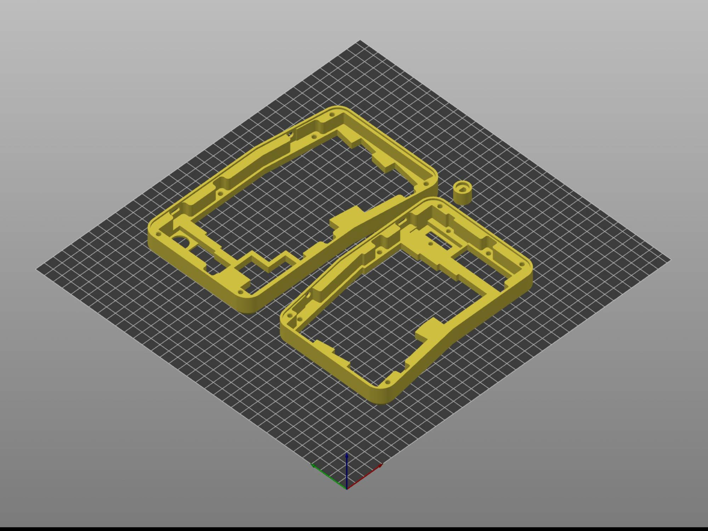
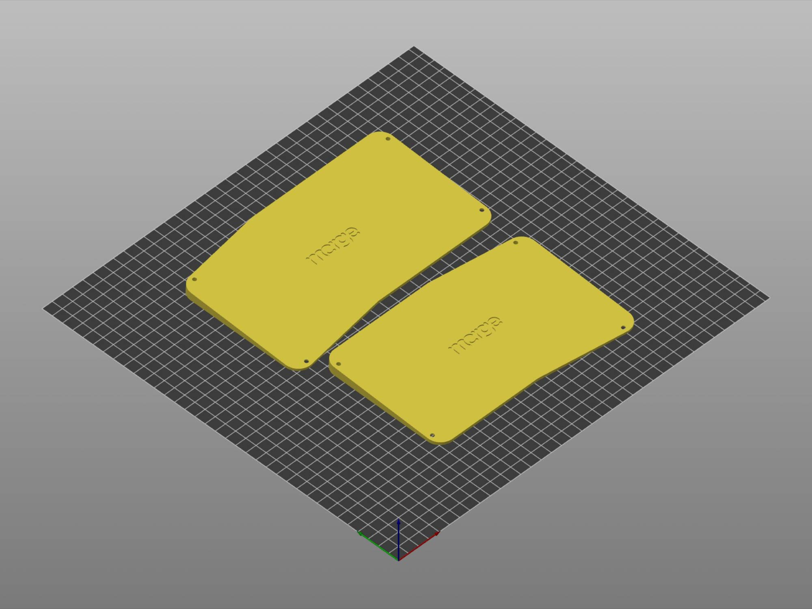
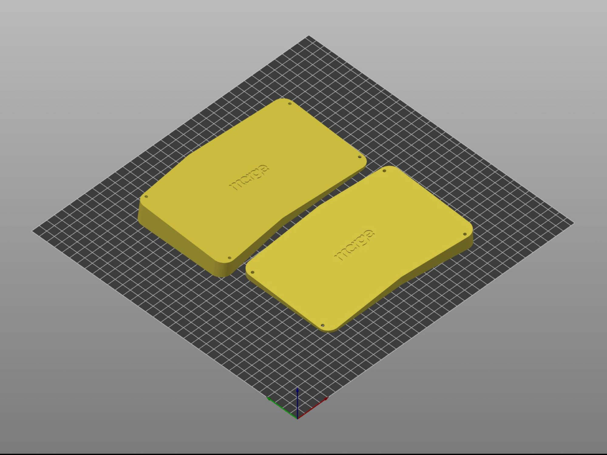
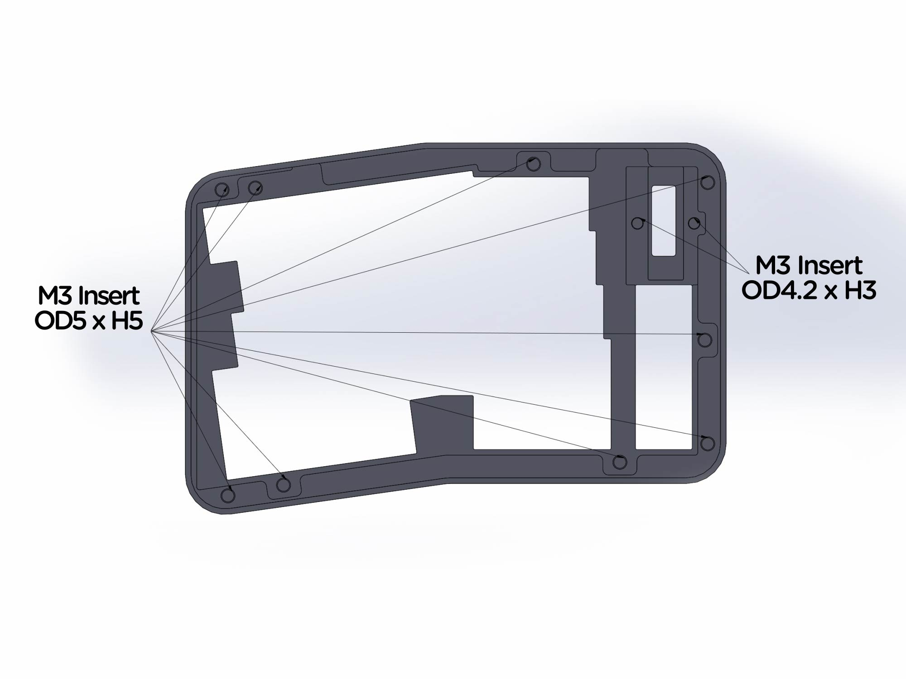
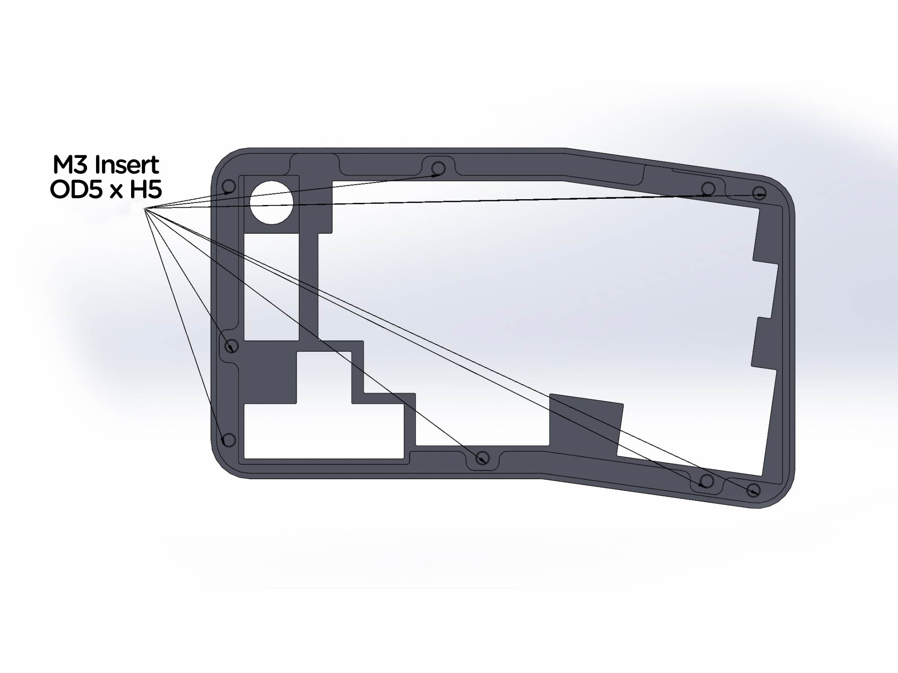

# **Print guide**

## **Print files**

There are 5 parts need to be printed in order to complete the build.
- Left case (UM-A_L_Top_v11.STL)
- Left cover / tented cover (UM-A_L_Cover_v11.STL / UM-A_R_Cover_Tented_v11.STL)
- Right case ANSI / ISO (UM-A_R_Top_v11_ANSI.STL / UM-A_R_Top_v11_ISO.STL)
- Right cover / tented cover (UM-A_L_Cover_11.STL / UM-A_R_Cover_Tented_v11.STL)
- Knob (UM-A_Knob_v1.STL)

## **Recommended print setting**

- 0.4mm Nozzle
- 0.2mm layer height
- ≥ 15% infill

All parts are designed to be printed with 0.4 nozzle at 0.2mm layer height without support, see print orientation.

## **Thread Inserts**

PCB kit comes with heat-set threaded inserts for both halves. All mount holes are designed to accept M3 OD5 x H5 except OLED mounts which is OD4.2 x H3. See above for details.
